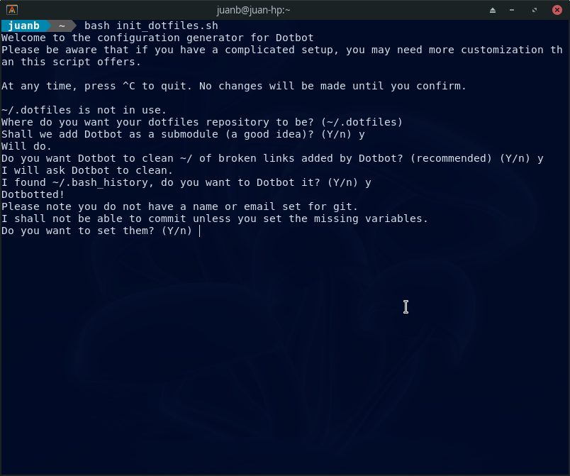
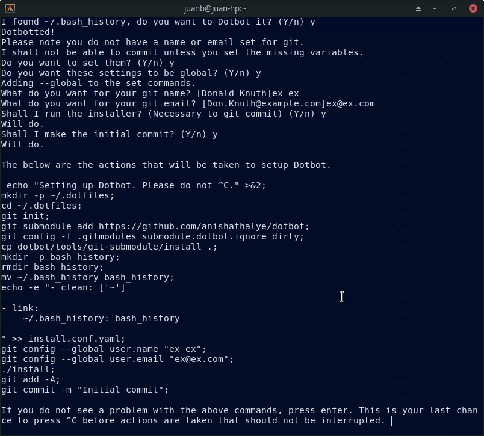

# Dotfiles
## Mis Archivos de Configuraciones de ArchLinux

Después de batallar con las configuraciones de las aplicaciones en distintas distribuciones de Linux, googlee y me encontré con distintos tutoriales donde se recomienda hacer uso de un sistema de control de versiones (scv), así como con otras herramientas de administración de archivos de configuración (comúnmente llamados “dotfiles”).

Me decidí por [dotbot][dotbot-repo] como gestor de archivos, [Git][git-repo] como sistema de control de versiones, [Github][github-repo] como servicio de alojamiento de repositorios Git basado en la nube, y por [este][scrpt-repo] script para facilitarme aun mas la tarea (soy un poco huevon)

## Listos en menos de lo que canta un gallo
------------------------------------------
Se abre la terminal y se escriben los siguientes comandos:
```bash
  curl -fsSLO https://raw.githubusercontent.com/Vaelatern/init-dotfiles/master/init_dotfiles.sh
  chmod +x ./init_dotfiles.sh
```
Bien!!!! pero que ha pasado? 
Primeramente se ha utilizado `curl` que es una herramienta de línea de comandos para transferir datos hacia o desde un servidor.
Con `chmod` cambiamos los permisos del archivo y lo hicimos ejecutable

Con la siguiente instrucción ejecutamos el script
```bash
./init_dotfiles.sh
```
En mi caso ejecute el script con bash

Mencionar que solo hay que oprimir enter en la primer pregunta



[dotbot-repo]: https://github.com/anishathalye/dotbot
[scrpt-repo]: (https://github.com/Vaelatern/init-dotfiles)
[git-repo]: https://git-scm.com/
[github-repo]: https://github.com/